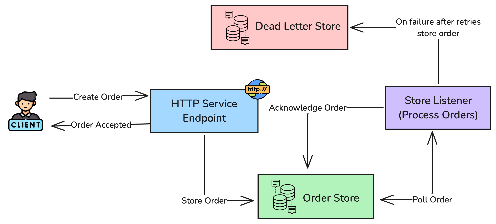

# Guaranteed Delivery Example

## Overview

This example demonstrates how to implement a guaranteed delivery pattern in Ballerina using message stores, listeners, 
and retry mechanisms. The system ensures that messages (orders) are processed reliably, with automatic retries for 
transient failures and dead letter queue handling for persistent failures.

### Key Components

- **HTTP Service**: REST API endpoint for receiving order requests
- **Message Store**: In-memory storage for order messages awaiting processing
- **Message Processor**: Asynchronous service that processes orders with retry logic
- **Dead Letter Queue**: Storage for messages that consistently fail processing
- **Error Simulation**: Demonstrates handling of both transient and permanent errors

## Implementation

### Message Processing Flow

1. **Order Reception**: Orders are received via HTTP POST to `/orders/createOrder`
2. **Message Storage**: Orders are stored in the `orderMessageStore` for asynchronous processing
3. **Asynchronous Processing**: The `orderProcessorListener` polls the message store every 5 seconds
4. **Retry Logic**: Failed orders are retried up to 3 times with 2-second intervals
5. **Dead Letter Queue**: Orders that fail all retries are moved to the `deadLetterStore`



### Error Handling Scenarios

The example simulates two types of failures:

- **Transient Error**: "OrderXYZ" fails once (simulating temporary service unavailability) then succeeds
- **Permanent Error**: "CriticalOrderABC" always fails and eventually moves to the dead letter queue

### Configuration

- **Polling Interval**: 5 seconds
- **Max Retries**: 3 attempts
- **Retry Interval**: 2 seconds between attempts
- **HTTP Port**: 9090

## Starting the Services

1. **Prerequisites**: Ensure you have Ballerina installed on your system

2. **Navigate to the project directory**:

   ```bash
   cd examples/guaranteed-delivery
   ```

3. **Enable debug logging**: Create a `Config.toml` file with the following content to enable debug logging:

   ```toml
   [ballerina.log]
   level = "DEBUG"
   ```

4. **Run the application**:

   ```bash
   bal run
   ```

## Testing the Services

### Test 1: Successful Order Processing

Send a regular order that will be processed successfully:

```bash
curl -X POST http://localhost:9090/api/orders \
  -H "Content-Type: application/json" \
  -d '{
    "orderId": "Order123",
    "customerName": "John Doe",
    "amount": 99.99
  }'
```

**Expected Behavior**:

- Order is accepted immediately (HTTP 202)
- Order is processed successfully within 5 seconds
- Success log messages appear in the console

### Test 2: Transient Error Handling

Send an order that will fail once then succeed:

```bash
curl -X POST http://localhost:9090/api/orders \
  -H "Content-Type: application/json" \
  -d '{
    "orderId": "OrderXYZ",
    "customerName": "Jane Smith",
    "amount": 149.99
  }'
```

**Expected Behavior**:

- Order is accepted immediately (HTTP 202)
- First processing attempt fails with "Inventory service unavailable"
- Order is retried after 2 seconds and succeeds
- Both error and success log messages appear

### Test 3: Permanent Error and Dead Letter Queue

Send an order that will consistently fail:

```bash
curl -X POST http://localhost:9090/api/orders \
  -H "Content-Type: application/json" \
  -d '{
    "orderId": "CriticalOrderABC",
    "customerName": "Bob Wilson",
    "amount": 299.99
  }'
```

**Expected Behavior**:

- Order is accepted immediately (HTTP 202)
- Processing fails 3 times with "Invalid order data" error
- After 3 failed attempts, order is moved to dead letter queue
- Multiple error log messages appear showing retry attempts

### Monitoring Logs

Watch the console output to observe:

- Order reception and storage
- Processing attempts and failures
- Retry mechanisms in action
- Dead letter queue movements

## Key Features Demonstrated

1. **Asynchronous Processing**: Orders are processed independently of the HTTP request
2. **Retry Logic**: Automatic retry with configurable attempts and intervals
3. **Dead Letter Queue**: Failed messages are preserved for manual intervention
4. **Error Differentiation**: Handling of both transient and permanent errors
5. **Guaranteed Delivery**: Messages are not lost even when processing fails

This example provides a foundation for building robust, fault-tolerant message processing systems in Ballerina.
